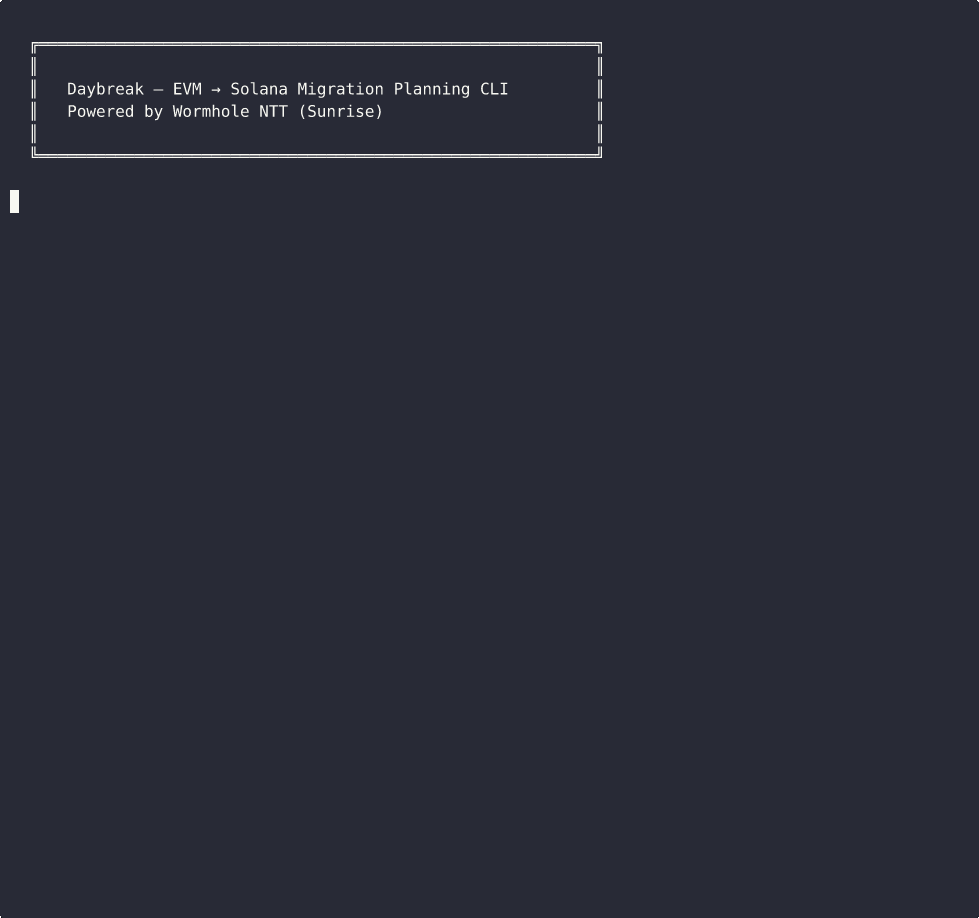

# Daybreak

**Migration planning CLI for moving EVM tokens to Solana via [Sunrise](https://wormhole.com/products/ntt) (Wormhole NTT).**




Daybreak analyzes any ERC-20 token on-chain — bytecode, capabilities, proxy patterns, bridge status — and tells you exactly how to migrate it to Solana using Native Token Transfers. It scores risk, recommends NTT modes, and generates deployment configs.

## Why Daybreak?

Moving an ERC-20 token to Solana means reading Wormhole docs, understanding NTT modes, checking decimal compatibility, analyzing bytecode for blockers, and manually writing deployment configs. **Daybreak does all of this in one command.**

- **Instant analysis** — Risk score, compatibility verdict, and mode recommendation in seconds
- **Zero guesswork** — Generates `deployment.json` and NTT CLI commands ready to run
- **Discovery at scale** — `list` finds migration candidates you didn't know about
- **Real deployment** — `deploy` creates SPL tokens on Solana directly from the CLI

## Quick Start

```bash
cargo install --path .

# Discover migration-ready tokens (the "wow" moment)
daybreak list --limit 5

# Analyze a specific token
daybreak scan 0xfAbA6f8e4a5E8Ab82F62fe7C39859FA577269BE3 --chain ethereum

# Generate migration report + deployment config
daybreak report 0xfAbA6f8e4a5E8Ab82F62fe7C39859FA577269BE3 --chain ethereum -o ./output

# Compare migration paths (NTT vs Neon EVM vs native rewrite)
daybreak compare 0xfAbA6f8e4a5E8Ab82F62fe7C39859FA577269BE3 --chain ethereum

# Deploy SPL token on Solana devnet
daybreak deploy 0xfAbA6f8e4a5E8Ab82F62fe7C39859FA577269BE3 --chain ethereum --network devnet
```

## Example Output

```
════════════════════════════════════════════════════════════
USD Coin (USDC) on Ethereum
════════════════════════════════════════════════════════════
── Token Information ──
  Address:      0xa0b86991c6218b36c1d19d4a2e9eb0ce3606eb48
  Decimals:     6
  Total Supply: 51280578956161361

── Capabilities ──
  Mintable           No
  Burnable           No
  Pausable           No
  Blacklist          No
  Permit (EIP-2612)  No
  Upgradeable        Yes

── Bytecode Analysis ──
  Size:         2186 bytes (Simple (<5KB))
  Is Proxy:     Yes
  ⚠ Has selfdestruct

── Bridge Status ──
  ! Token already exists on Solana
  Solana Address: EPjFWdd5AufqSSqeM2qN1xzybapC8G4wEGGkZwyTDt1v
  Bridge: Native

── NTT Compatibility ──
  Status:     Compatible
  Mode:       Locking
  Issues:
    [WARN] Self-destruct Capability
    [INFO] Upgradeable Proxy

── Risk Score ──
  Score:  23/100 (Low Risk)
  Components:
    Decimal handling:     0/20
    Token features:       3/25
    Bytecode complexity:  5/20
    Holder concentration: 0/15
    Bridge status:        15/20
```

## List: Discover Migration Candidates

```
═══════════════════════════════════════════════════════════════════════════════
  Symbol   Decimals   Risk       Compatible   Mode       Status
───────────────────────────────────────────────────────────────────────────────
  ONDO     18         15/100     ✓            Locking    Not on Solana — strong candidate
  AAVE     18         15/100     ✓            Locking    Not on Solana — strong candidate
  UNI      18         18/100     ✓            Locking    Not on Solana — strong candidate
  LINK     18         18/100     ✓            Locking    Not on Solana — strong candidate
  COMP     18         10/100     ✓            Locking    Not on Solana — strong candidate
  USDC     6          23/100     ✓            Locking    Already on Solana (Native)
  USDT     6          23/100     ✓            Locking    Already on Solana (Wormhole)
═══════════════════════════════════════════════════════════════════════════════

  Found 5 tokens ready for migration to Solana via NTT.
  Run daybreak scan <address> for detailed analysis.
```

## Example Reports

See [examples/](examples/) for sample migration reports:
- [ONDO](examples/ondo/report.md) — Strong migration candidate (not yet on Solana)
- [AAVE](examples/aave/report.md) — DeFi governance token analysis

## Commands

| Command | Description | Key Flags |
|---------|-------------|-----------|
| `list` | Discover migration-ready ERC-20 tokens | `--chain`, `--limit`, `--json` |
| `scan` | Full token analysis with risk scoring | `--chain`, `--skip-holders`, `--json` |
| `report` | Generate migration report + NTT deployment config | `--chain`, `-o/--output`, `--skip-holders` |
| `compare` | Compare migration paths (NTT / Neon EVM / native) | `--chain`, `--json` |
| `deploy` | Deploy SPL token on Solana (devnet/mainnet) | `--chain`, `--network`, `--keypair` |

**Global flags:** `--rpc-url` (custom RPC), `--etherscan-key` (holder data)

## How It Works

1. **EVM RPC** — Fetches token metadata, bytecode, and capabilities via raw JSON-RPC calls
2. **Bytecode analysis** — Detects proxy patterns, selfdestruct, function selectors (mint/burn/pause/blacklist)
3. **Bridge detection** — Checks if the token already exists on Solana (Jupiter, native, Wormhole-wrapped)
4. **Risk scoring** — Scores 0-100 across decimals, features, complexity, holders, and bridge status
5. **NTT config** — Recommends locking/burning mode and generates `deployment.json` for NTT CLI

## Supported Chains

Ethereum, Polygon, BSC, Arbitrum, Base, Optimism, Avalanche

## Built With

Rust, [clap](https://docs.rs/clap), [tokio](https://tokio.rs), [reqwest](https://docs.rs/reqwest), [serde](https://serde.rs), [colored](https://docs.rs/colored)

## Hackathon

Built for the **[Solana Graveyard Hackathon](https://solana.com/graveyard-hack)** — Sunrise track.

Bringing dead EVM tokens back to life on Solana.

## License

[MIT](LICENSE)
